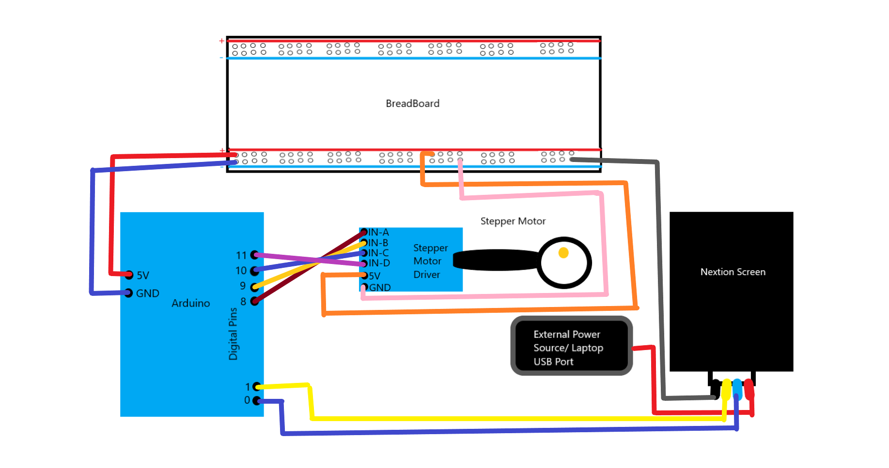

# Nextion-X-StepperMotor
## Control a Arduino stepper motor using a Nextion screen

## Parts Used:
	- Arduino Uno
	- 28BYJ-48 Stepper Motor with Driver
	- NEXTION NX4024T032 - GENERIC 3.2" Screen
	- BreadBoard
	- A bunch of Wires

## Diagram

## Setup
	1. Follow the diagram above
	2. Upload the TFT file to the Nextion Screen
	3. Upload the .ino file to the Arduino(When uploading make sure the no wire are in the Pins 1 and 2(Serial Ports) otherwise a error will show up)

## Interface
