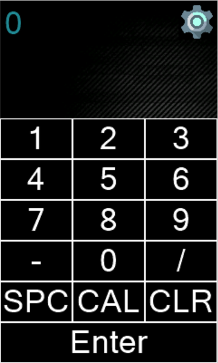

# Nextion-X-StepperMotor
## Control a Arduino stepper motor using a Nextion screen

## Parts Used:
	- Arduino Uno
	- 28BYJ-48 Stepper Motor with Driver
	- NEXTION NX4024T032 - GENERIC 3.2" Screen
	- BreadBoard
	- A bunch of Wires

## Diagram

## Setup
	1. Follow the diagram above
	2. Upload the TFT file to the Nextion Screen via a mico SD Card
	3. Install all necessary libraries to the Arduino Editor
	4. Upload the .ino file to the Arduino Uno(When uploading make sure that there are no wires in the Pins 0 and 1(Serial Ports) otherwise a error will show up)

## Interface

	
	- The blue text above is the current position of the motor
	- Enter integers, fractions or both(using the SPC button)
	- CAL or Calibration allows the user to change the current position without the motor turning
	- The Setting button on the top right allows the user to go to the setting page and change the speed of the motor

## Example
	User: 1 1/4 -> Enter
	Motor: Rotates a full Revolution and then a Quarter of a Revolution to get to the "1 1/4" position
	
	User: 2 -> Enter
	Motor: Rotates 3/4 of a Revolution to get to the "2" position
	
	User: -1 -> Enter
	Motor: Rotates back 3 full Revolutions back to get to the "-1" position 
	
	User: 0 -> CAL
	Motor: Does not rotate but it is now at the "0" position
	
	User: 1 -> Enter
	Motor: Rotates a full Revolution to get to the "1" position
	
## Update
	Added the .hmi file so anyone can play around with the display
